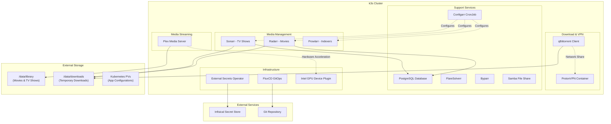
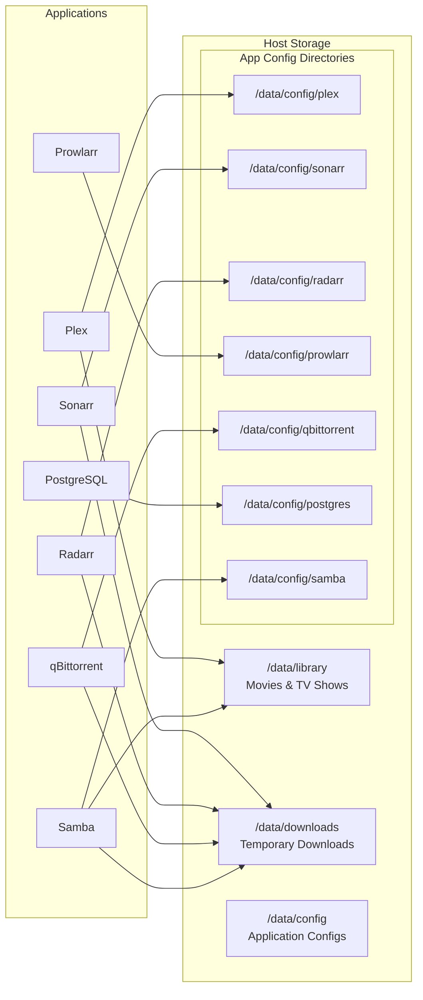

# Design Document

## Overview

This design outlines the migration of a self-hosted Plex media server ecosystem from Ansible/Podman to Kubernetes (k3s) with FluxCD GitOps. The system consists of 8 main applications that work together to provide automated media acquisition, organization, and streaming capabilities.

The migration will maintain all existing functionality while modernizing the infrastructure to use Kubernetes-native patterns for deployment, networking, storage, and secret management.

## Architecture

### High-Level Architecture



### Deployment Strategy

The migration will use a **phased approach** with the following stages:

1. **Infrastructure Setup** - k3s, FluxCD, External Secrets Operator
2. **Database Migration** - PostgreSQL with data migration
3. **Core Services** - Plex, Prowlarr, FlareSolverr, Byparr
4. **Media Management** - Sonarr, Radarr (connecting to migrated database)
5. **Download Services** - ProtonVPN + qBittorrent integration
6. **File Sharing** - Samba (if needed)
7. **Integration Testing** - End-to-end workflow validation

## Components and Interfaces

### 1. Plex Media Server

**Purpose:** Stream media content with hardware-accelerated transcoding

**Container Image:** `ghcr.io/onedr0p/plex:1.41.5.9522`

**Key Requirements:**
- Intel QuickSync hardware acceleration via `/dev/dri` devices
- Access to media library at `/data/library` (host path)
- Persistent volume for Plex configuration and metadata
- Network access for discovery and streaming (ports 32400, 1900, 3005, etc.)

**Kubernetes Resources:**
- Deployment with device plugin for GPU access
- Host path volume for configuration (`/data/config/plex`)
- NodePort Service for external access (port 32400)
- ConfigMap for environment variables

### 2. Media Management Applications

#### Sonarr (TV Shows)
**Container Image:** `ghcr.io/onedr0p/sonarr:4.0.14.2938`
- Port: 8989
- Database: PostgreSQL (sonarr_main, sonarr_logs)
- Volumes: Host path for config (`/data/config/sonarr`), shared access to `/data` paths

#### Radarr (Movies)  
**Container Image:** `ghcr.io/onedr0p/radarr:5.20.1.9773`
- Port: 7878
- Database: PostgreSQL (radarr_main, radarr_logs)
- Volumes: Host path for config (`/data/config/radarr`), shared access to `/data` paths

#### Prowlarr (Indexer Management)
**Container Image:** `ghcr.io/linuxserver/prowlarr:1.35.1`
- Port: 9696
- Volumes: Host path for config (`/data/config/prowlarr`)
- DNS: Custom DNS servers (9.9.9.9, 149.112.112.112)

### 3. Download Infrastructure

#### ProtonVPN Container
**Container Image:** `ghcr.io/tprasadtp/protonwire:7.5.3`
- Capabilities: NET_ADMIN
- Secrets: ProtonVPN private key via External Secrets
- Network: Provides VPN tunnel for qBittorrent

#### qBittorrent
**Container Image:** `ghcr.io/onedr0p/qbittorrent:5.0.4`
- Port: 8080 (via VPN container)
- Network: Shared with ProtonVPN container
- Volumes: Host path for config (`/data/config/qbittorrent`), access to `/data/downloads`

### 4. Support Services

#### PostgreSQL Database
**Container Image:** `postgres:16-alpine` (official PostgreSQL image)
- Port: 5432
- Databases: sonarr_main, sonarr_logs, radarr_main, radarr_logs
- Volume: Host path for database storage (`/data/config/postgres`)
- Credentials: Managed via External Secrets

#### FlareSolverr
**Container Image:** `ghcr.io/flaresolverr/flaresolverr:v3.3.19`
- Port: 8191
- Purpose: Bypass Cloudflare protection for indexers

#### Byparr
**Container Image:** `ghcr.io/thephaseless/byparr:1.1.1`
- Port: 39001
- Purpose: Additional content discovery capabilities

#### Configarr
**Container Image:** `ghcr.io/raydak-labs/configarr:latest`
- **Deployment Type:** CronJob (runs periodically, not continuously)
- **Purpose:** Automated configuration management using TRaSH Guides and Recyclarr templates
- **Features:** 
  - Quality profiles and definitions from TRaSH Guides
  - Custom formats for optimal media quality
  - Automated configuration sync for Sonarr, Radarr, and Prowlarr
  - Repository caching for configuration templates
- **Schedule:** Hourly execution to keep configurations in sync
- **Volumes:** Host path for repository cache (`/data/config/configarr`), ConfigMap for config.yml, Secret for API keys
- **API Integration:** Connects to Sonarr, Radarr, and Prowlarr APIs for configuration updates

#### Samba File Server
**Container Image:** `quay.io/samba.org/samba-server:latest`
- Ports: 445, 3702, 5355
- Volumes: Host paths for config (`/data/config/samba`), media access, and watched folders
- Network: Host networking for SMB discovery

## Data Models

### Storage Architecture (Single Node - Host Paths)



### User and Permission Model

Current Ansible setup uses `--userns=keep-id --user=1000` which will be replaced with proper Kubernetes security contexts:

**Security Context Configuration:**
- **User ID:** 1000 (determined from current podman inspect)
- **Group ID:** 1000 
- **FSGroup:** 1000 (for volume ownership)
- **Supplemental Groups:** As needed for device access

**Special Cases:**
- **Plex:** Requires access to `/dev/dri` devices (group: video, render)
- **PostgreSQL:** Uses postgres user (UID determined by image)
- **Samba:** Requires specific SMB user configuration

## Error Handling

### Application Health Monitoring

Each application will implement:
- **Liveness Probes:** Detect if application needs restart
- **Readiness Probes:** Determine if application can serve traffic
- **Startup Probes:** Handle slow-starting applications

### VPN Connection Monitoring

Critical for download security:
- **ProtonVPN Health Checks:** Monitor VPN tunnel status
- **Network Policy Enforcement:** Block qBittorrent if VPN fails
- **Automatic Recovery:** Restart VPN container on failure

### Data Integrity

- **Database Backups:** Regular PostgreSQL backups via CronJob
- **Configuration Backups:** PVC snapshots where supported
- **Media Validation:** Health checks for media file accessibility

### Deployment Rollback Strategy

Each deployment phase includes:
- **GitOps Rollback:** Use FluxCD to rollback to previous working versions
- **Configuration Snapshots:** Backup configurations before major changes
- **Service Validation:** Health checks to ensure services are working correctly
- **Rollback Procedures:** Documented steps to return to previous working state

## Testing Strategy

### Unit Testing (Per Application)

**Phase Testing Approach:**
1. **Container Startup:** Verify each application starts correctly
2. **Configuration Loading:** Validate settings and database connections
3. **Volume Mounting:** Confirm persistent data access
4. **Network Connectivity:** Test inter-service communication

### Integration Testing

**End-to-End Workflows:**
1. **Media Discovery:** Prowlarr → Sonarr/Radarr → qBittorrent → Download
2. **Content Processing:** Download → Organization → Plex Library Update
3. **Streaming:** Plex transcoding and client access
4. **File Sharing:** Samba access to media and download folders

### Performance Testing

**Hardware Acceleration Validation:**
- Intel QuickSync functionality in Kubernetes
- Transcoding performance comparison with Ansible setup
- GPU device plugin proper operation

**Network Performance:**
- VPN throughput testing
- Inter-pod communication latency
- External service access speeds

### Security Testing

**VPN Leak Testing:**
- Verify qBittorrent traffic routes through VPN
- Test behavior when VPN connection fails
- Validate IP address masking

**Secret Management:**
- External Secrets Operator functionality
- Secret rotation capabilities
- No plaintext secrets in Git repository

## Configuration Management

### Application Configuration Strategy

Each application will maintain its configuration through a combination of:

1. **Kubernetes ConfigMaps** - Non-sensitive configuration data
2. **External Secrets** - Sensitive configuration (passwords, API keys)
3. **Persistent Volumes** - Application-specific configuration files and databases
4. **Environment Variables** - Runtime configuration passed to containers

### Fresh Installation Configuration

**Helm Values Configuration:**

All applications will be configured through Helm values:

```yaml
# values.yaml
plex:
  enabled: true
  image: ghcr.io/onedr0p/plex:1.41.5.9522 # {"$imagepolicy": "media-server:plex"}
  port: 32400
  hostPath: /data

sonarr:
  enabled: true
  image: ghcr.io/onedr0p/sonarr:4.0.14.2938 # {"$imagepolicy": "media-server:sonarr"}
  port: 8989
  database:
    main: sonarr_main
    logs: sonarr_logs

radarr:
  enabled: true
  image: ghcr.io/onedr0p/radarr:5.20.1.9773 # {"$imagepolicy": "media-server:radarr"}
  port: 7878
  database:
    main: radarr_main
    logs: radarr_logs

prowlarr:
  enabled: true
  image: ghcr.io/linuxserver/prowlarr:1.35.1 # {"$imagepolicy": "media-server:prowlarr"}
  port: 9696

qbittorrent:
  enabled: true
  image: ghcr.io/onedr0p/qbittorrent:5.0.4 # {"$imagepolicy": "media-server:qbittorrent"}
  port: 8080

postgresql:
  enabled: true
  image: postgres:16-alpine # {"$imagepolicy": "media-server:postgresql"}
  port: 5432

protonvpn:
  enabled: true
  image: ghcr.io/tprasadtp/protonwire:7.5.3 # {"$imagepolicy": "media-server:protonvpn"}
  server: 45.128.134.194

configarr:
  enabled: true
  image: ghcr.io/raydak-labs/configarr:latest # {"$imagepolicy": "media-server:configarr"}
  schedule: "0 * * * *"

flaresolverr:
  enabled: true
  image: ghcr.io/flaresolverr/flaresolverr:v3.3.19 # {"$imagepolicy": "media-server:flaresolverr"}
  port: 8191

byparr:
  enabled: true
  image: ghcr.io/thephaseless/byparr:1.1.1 # {"$imagepolicy": "media-server:byparr"}
  port: 39001

samba:
  enabled: true
  image: quay.io/samba.org/samba-server:latest # {"$imagepolicy": "media-server:samba"}
  ports:
    smb: 445
    wsdd: 3702
    llmnr: 5355
```

### Per-Application Configuration

#### Plex Configuration
- **Web Interface:** `http://node-ip:32400/web` for initial setup
- **Library Setup:** Configure movie and TV show libraries pointing to `/data/library`
- **Hardware Acceleration:** Enable Intel QuickSync in transcoding settings
- **Users & Access:** Configure Plex Pass features and user accounts
- **Persistent Config:** All settings stored in `/data/config/plex` host path

#### Sonarr Configuration  
- **Database Connection:** Auto-configured via environment variables to PostgreSQL
- **Download Client:** Configure qBittorrent connection (internal Kubernetes service)
- **Indexers:** Import from Prowlarr via API integration
- **Quality Profiles:** Configure preferred quality and formats
- **Root Folders:** Set to `/data/library/tvshows` and `/data/downloads/tvshows`

#### Radarr Configuration
- **Database Connection:** Auto-configured via environment variables to PostgreSQL  
- **Download Client:** Configure qBittorrent connection (internal Kubernetes service)
- **Indexers:** Import from Prowlarr via API integration
- **Quality Profiles:** Configure preferred quality and formats
- **Root Folders:** Set to `/data/library/movies` and `/data/downloads/movies`

#### Prowlarr Configuration
- **Indexers:** Manual addition of torrent and usenet indexers
- **Applications:** Configure Sonarr and Radarr API connections for automatic sync
- **FlareSolverr:** Configure connection for Cloudflare bypass
- **Categories:** Map indexer categories to Sonarr/Radarr categories

#### Configarr Automated Configuration
- **TRaSH Guides Integration:** Automatically applies recommended quality profiles and custom formats
- **Template-Based Setup:** Uses Recyclarr config templates for consistent configuration
- **Periodic Sync:** CronJob runs hourly to keep configurations up-to-date
- **Multi-Application Support:** Configures Sonarr, Radarr, and Prowlarr simultaneously
- **Quality Definitions:** Applies optimal quality settings for different content types
- **Custom Formats:** Implements advanced filtering and quality preferences
- **Configuration as Code:** All settings defined in YAML configuration files

#### qBittorrent Configuration
- **VPN Verification:** Ensure all traffic routes through ProtonVPN
- **Download Paths:** Configure completed downloads to go to `/data/downloads`
- **Categories:** Set up automatic categorization for movies vs TV shows
- **Connection Limits:** Configure appropriate limits for VPN connection

### Configuration Management (Fresh Installation)

**Initial Setup Strategy:**
- **Fresh Databases:** PostgreSQL will create new empty databases for Sonarr and Radarr
- **Clean Configuration:** All applications start with default configurations
- **Automated Setup:** Configarr will apply TRaSH Guide configurations after initial deployment
- **GitOps State:** All Kubernetes manifests versioned in Git for reproducible deployments

**Backup Strategy (Post-Installation):**
- **Database Backups:** PostgreSQL dumps via CronJob to external storage
- **Host Path Backups:** Regular backups of `/data/config` directory
- **Configuration Export:** Scripts to export application configurations
- **GitOps State:** All Kubernetes manifests versioned in Git

## Implementation Considerations

### FluxCD GitOps Structure with Helm Chart

```
k8s-manifests/
├── infrastructure/
│   ├── external-secrets/
│   │   ├── helmrelease.yaml
│   │   └── helmrepository.yaml
│   ├── intel-device-plugin/
│   │   ├── helmrelease.yaml
│   │   └── helmrepository.yaml
│   └── kustomization.yaml
├── apps/
│   └── media-server/
│       ├── helmrelease.yaml
│       └── kustomization.yaml
└── charts/
    └── media-server/
        ├── Chart.yaml
        ├── values.yaml
        ├── values-prod.yaml
        └── templates/
            ├── plex/
            │   ├── deployment.yaml
            │   ├── service.yaml
            │   └── configmap.yaml
            ├── sonarr/
            │   ├── deployment.yaml
            │   ├── service.yaml
            │   └── configmap.yaml
            ├── radarr/
            ├── prowlarr/
            ├── qbittorrent/
            ├── protonvpn/
            ├── postgresql/
            ├── flaresolverr/
            ├── byparr/
            ├── configarr/
            │   ├── cronjob.yaml
            │   ├── configmap.yaml
            │   └── externalsecret.yaml
            ├── samba/
            └── _helpers.tpl
```

**Chart.yaml Structure:**
```yaml
apiVersion: v2
name: media-server
description: Complete Plex media server with automated content management
type: application
version: 0.1.0
appVersion: "1.0"
# No external dependencies - all services managed within the chart
```

**FluxCD HelmRelease:**
```yaml
apiVersion: helm.toolkit.fluxcd.io/v2beta1
kind: HelmRelease
metadata:
  name: media-server
  namespace: media-server
spec:
  interval: 15m
  chart:
    spec:
      chart: ./charts/media-server
      sourceRef:
        kind: GitRepository
        name: media-server-config
      interval: 15m
  valuesFrom:
    - kind: ConfigMap
      name: media-server-values
      valuesKey: values.yaml
```

**Template Usage Example:**
```yaml
# templates/radarr/deployment.yaml
apiVersion: apps/v1
kind: Deployment
metadata:
  name: {{ include "media-server.fullname" . }}-radarr
spec:
  template:
    spec:
      containers:
      - name: radarr
        image: {{ .Values.radarr.image }}
        ports:
        - containerPort: {{ .Values.radarr.port }}
        env:
        - name: RADARR__POSTGRES_HOST
          value: {{ include "media-server.fullname" . }}-postgresql
        - name: RADARR__POSTGRES_MAIN_DB
          value: {{ .Values.radarr.database.main }}
```

### External Secrets Integration

**Infisical Secret Management:**
- **ProtonVPN private key:** VPN tunnel authentication
- **PostgreSQL passwords:** Database access credentials
- **Samba user credentials:** File sharing authentication
- **API Keys:** Inter-service communication (Sonarr, Radarr, Prowlarr APIs)

**Secret Store:**
- **Infisical:** External secret management platform
- **External Secrets Operator:** Kubernetes operator to sync secrets from Infisical
- **Secret Types:** ProtonVPN keys, database passwords, API keys

**Installation Strategy:**
- **Controllers Only:** Setup scripts install only ESO controllers and CRDs
- **Secret Zero:** Infisical authentication credentials pushed via script arguments
- **Helm Chart Management:** SecretStore and ExternalSecret resources managed via Helm charts
- **Separation of Concerns:** Infrastructure setup separate from application configuration

### Required Infisical Secrets

The following secrets must be created in Infisical before deployment, organized into logical folders for better management:

#### Folder Structure in Infisical
```
/media-server/
├── database/
│   ├── POSTGRES_USER: postgres
│   ├── POSTGRES_PASSWORD: <secure-random-password>
│   └── POSTGRES_DB: postgres
├── vpn/
│   ├── PROTONVPN_PRIVATE_KEY: <protonvpn-wireguard-private-key>
│   └── PROTONVPN_SERVER: 45.128.134.194
├── api-keys/
│   ├── SONARR_API_KEY: <generated-after-sonarr-setup>
│   ├── RADARR_API_KEY: <generated-after-radarr-setup>
│   └── PROWLARR_API_KEY: <generated-after-prowlarr-setup>
└── samba/ (optional)
    ├── SAMBA_USER: mediauser
    ├── SAMBA_PASSWORD: <secure-random-password>
    └── SAMBA_WORKGROUP: WORKGROUP
```

**Secret Storage Strategy:**
- **Organized Folders:** Secrets are grouped into logical folders for better organization
- **Absolute Paths:** When referencing secrets outside the default `secretsPath`, use absolute paths
- **Simple Key-Value:** Each secret is stored as a direct key-value pair in Infisical
- **No JSON Nesting:** Avoid complex JSON structures for easier management
- **Direct Mapping:** Secret names in Infisical match the environment variable names in applications


#### Secret Creation Order

1. **Infisical setup** (create first):
   - Create Machine Identity in Infisical with Universal Auth
   - Generate Client ID and Client Secret
   - Create `infisical-auth` Kubernetes secret with credentials
   - Deploy SecretStore resource

2. **Create all secrets in Infisical** (can be created before deployment):
   - `postgres-credentials`
   - `protonvpn-credentials`
   - `application-api-keys` (initially with placeholder values, update after app setup)
   - `samba-credentials` (if using Samba)

Note: API keys can be initially set to placeholder values and updated later once applications generate their actual API keys. Configarr will gracefully handle missing or invalid API keys.

#### Infisical Authentication Setup

**Machine Identity Configuration:**
1. Create a Machine Identity in Infisical with Universal Auth
2. Generate Client ID and Client Secret pair
3. Push credentials via setup script arguments (secret zero approach)

**Setup Script Usage:**
```bash
# Install ESO controllers and create authentication secret
./scripts/setup/05-install-external-secrets.sh \
  --client-id "931a9617-e5ca-4d1a-8396-75a40973e699" \
  --client-secret "5c92d34ffe5436b93947326c0bce52fa0b5002ca70e42555ecf00b48728c77cf" \
  --environment "dev"
```

**Kubernetes Secret (Created by Script):**
```yaml
# Kubernetes secret for Infisical authentication (created automatically)
apiVersion: v1
kind: Secret
metadata:
  name: infisical-auth
  namespace: media-server
type: Opaque
stringData:
  clientId: <your-infisical-client-id>
  clientSecret: <your-infisical-client-secret>
  environment: <your-infisical-environment>
```

#### SecretStore Configuration (Helm Chart Managed)

**Note:** SecretStore resources are managed through Helm charts, not setup scripts.

```yaml
# charts/media-server/templates/external-secrets/secretstore.yaml
apiVersion: external-secrets.io/v1
kind: SecretStore
metadata:
  name: infisical-secret-store
  namespace: {{ .Values.namespace }}
spec:
  provider:
    infisical:
      auth:
        universalAuthCredentials:
          clientId:
            name: infisical-auth
            key: clientId
          clientSecret:
            name: infisical-auth
            key: clientSecret
      secretsScope:
        projectSlug: {{ .Values.infisical.projectId }}
        environmentSlug: {{ .Values.infisical.environment }}
        secretsPath: /media-server
```

#### ExternalSecret Resource Examples (Helm Chart Managed)

**Note:** ExternalSecret resources are managed through Helm charts in the `charts/media-server/templates/external-secrets/` directory.

**Secret Reference Strategy:**
- **Organized Folders:** Secrets are organized into logical folders for better management
- **Absolute Paths:** When referencing secrets outside the default `secretsPath`, use absolute paths like `/media-server/database/POSTGRES_USER`
- **Relative Paths:** When referencing secrets within the `secretsPath` (/media-server), you can use relative paths like `database/POSTGRES_USER`
- **No JSON Property Extraction:** Secrets are stored as simple key-value pairs, not JSON objects
- **Direct Secret Mapping:** Each Infisical secret maps directly to a Kubernetes secret key

```yaml
# charts/media-server/templates/external-secrets/postgres-secret.yaml
{{- if .Values.postgresql.enabled }}
apiVersion: external-secrets.io/v1beta1
kind: ExternalSecret
metadata:
  name: postgres-secret
  namespace: {{ .Values.namespace }}
spec:
  refreshInterval: 1h
  secretStoreRef:
    name: infisical-secret-store
    kind: SecretStore
  target:
    name: postgres-credentials
    creationPolicy: Owner
  data:
  - secretKey: POSTGRES_USER
    remoteRef:
      key: database/POSTGRES_USER
  - secretKey: POSTGRES_PASSWORD
    remoteRef:
      key: database/POSTGRES_PASSWORD
  - secretKey: POSTGRES_DB
    remoteRef:
      key: database/POSTGRES_DB
{{- end }}

---
# charts/media-server/templates/external-secrets/protonvpn-secret.yaml
{{- if .Values.protonvpn.enabled }}
apiVersion: external-secrets.io/v1beta1
kind: ExternalSecret
metadata:
  name: protonvpn-secret
  namespace: {{ .Values.namespace }}
spec:
  refreshInterval: 1h
  secretStoreRef:
    name: infisical-secret-store
    kind: SecretStore
  target:
    name: protonvpn-credentials
    creationPolicy: Owner
  data:
  - secretKey: PROTONVPN_PRIVATE_KEY
    remoteRef:
      key: vpn/PROTONVPN_PRIVATE_KEY
  - secretKey: PROTONVPN_SERVER
    remoteRef:
      key: vpn/PROTONVPN_SERVER
{{- end }}

---
# charts/media-server/templates/external-secrets/application-api-keys-secret.yaml
{{- if .Values.configarr.enabled }}
apiVersion: external-secrets.io/v1beta1
kind: ExternalSecret
metadata:  
  name: application-api-keys-secret
  namespace: {{ .Values.namespace }}
spec:
  refreshInterval: 1h
  secretStoreRef:
    name: infisical-secret-store
    kind: SecretStore
  target:
    name: application-api-keys
    creationPolicy: Owner
  data:
  - secretKey: SONARR_API_KEY
    remoteRef:
      key: api-keys/SONARR_API_KEY
  - secretKey: RADARR_API_KEY
    remoteRef:
      key: api-keys/RADARR_API_KEY
  - secretKey: PROWLARR_API_KEY
    remoteRef:
      key: api-keys/PROWLARR_API_KEY
{{- end }}

---
# charts/media-server/templates/external-secrets/samba-secret.yaml
{{- if .Values.samba.enabled }}
apiVersion: external-secrets.io/v1beta1
kind: ExternalSecret
metadata:
  name: samba-secret
  namespace: {{ .Values.namespace }}
spec:
  refreshInterval: 1h
  secretStoreRef:
    name: infisical-secret-store
    kind: SecretStore
  target:
    name: samba-credentials
    creationPolicy: Owner
  data:
  - secretKey: SAMBA_USER
    remoteRef:
      key: samba/SAMBA_USER
  - secretKey: SAMBA_PASSWORD
    remoteRef:
      key: samba/SAMBA_PASSWORD
  - secretKey: SAMBA_WORKGROUP
    remoteRef:
      key: samba/SAMBA_WORKGROUP
{{- end }}
```

### Device Plugin Requirements

**Intel GPU Device Plugin:**
- Enables `/dev/dri` device access in Kubernetes
- Required for Plex hardware acceleration
- Must be deployed as DaemonSet on nodes with Intel GPUs

### Network Architecture

**Single Node Networking:**
- Standard Kubernetes networking with NodePort services for external access
- Host networking for services requiring discovery (Plex, Samba)
- No need for LoadBalancers or Ingress controllers

**VPN Integration Pattern:**
- Sidecar container pattern for ProtonVPN + qBittorrent
- Shared network namespace between containers
- Network policies to enforce VPN routing